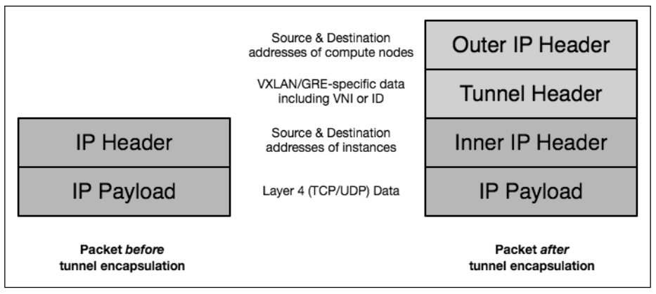

#####ARP

#####DHCP

#####Bridge

#####VLAN

#####GRE




#####FAQ

1. How many VLANs can I create?
 
    You can create 4094 because only 12 bits are used for VLANs in 802.1q, 
    so you can only use VLANs from 0-4095: 4096 different VLANs minus 2 (0 and 4095 are reserved).
    
    For more information read: https://en.wikipedia.org/wiki/IEEE_802.1Q#Frame_format

2. How many GRE tunnels can I create?
    
    65 535...

3. Can I bind two DHCP-servers to one interface?

    No.
    
4. How to change name of interface in Ubuntu 16.04 from ens3 to eth0?

    Edit /etc/default/grub:
    
```sh
# sed -i 's/^GRUB_CMDLINE_LINUX=""/GRUB_CMDLINE_LINUX="net.ifnames=0 biosdevname=0"/' /etc/default/grub
# update-grub
# sed -i 's/ens3/eth0/' /etc/network/interfaces
```