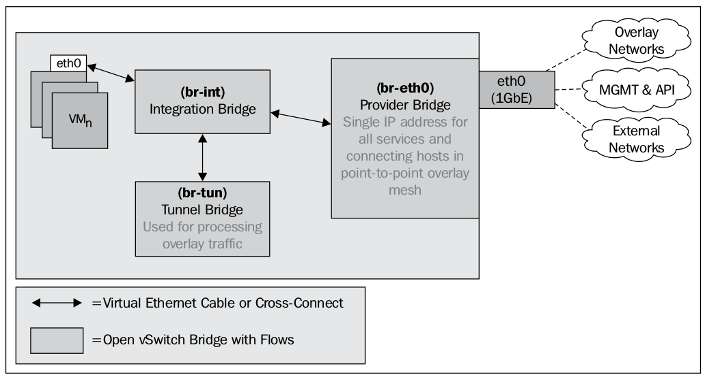
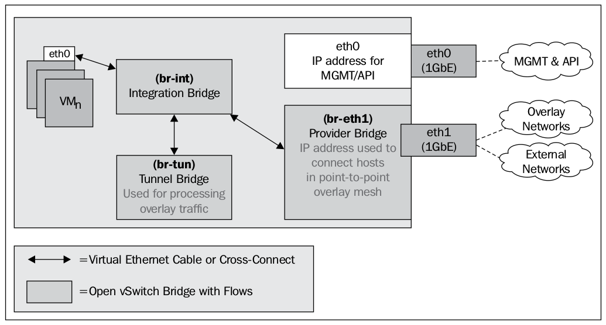

###<h3>What is Neutron</h3>
 
Neutron is OpenStack networking service, that includes neutron-server to expose an API and neutron-agents to perform actions on nodes.
Neutron supports multiple virtual switching platforms, including built-in Linux bridging and Open vSwitch, also known as OVS.
OpenStack Networking provides routing and NAT capabilities through the use of IP forwarding, iptables, and network namespaces. 
A network namespace is analogous to chroot for the network stack. Inside a network namespace, you can find sockets,
bound ports, and interfaces that were created in the namespace. Each network namespace has its own routing table and iptables process 
that provide filtering and network address translation, also known as NAT.

#####<h5>Types of network traffic</h5>

The reference architecture for OpenStack Networking defines at least four distinct
types of network traffic:

- Management
- API
- External
- Guest
    
These distinct types of network traffic do not require dedicated interfaces and are
often collapsed onto single interfaces. Depending on the chosen deployment model,
the cloud architecture may spread networking services across multiple nodes.

The **management network** is used for internal communication between hosts
for services, such as the messaging service and database service. All hosts will
communicate with each other over this network. The management network can be
configured as an isolated network on a dedicated interface or combined with another
networK.

The **API network** is used to expose OpenStack APIs to users of the cloud and services
within the cloud. Endpoint addresses for services, such as Keystone, Neutron,
Glance, and Horizon, are procured from the API network.

An **external network** provides Neutron routers with network access. Once a router
has been configured, this network becomes the source of floating IP addresses for
instances and load balancer VIPs. IP addresses in this network should be reachable
by any client on the Internet.

The **guest network** is a network dedicated to instance traffic. Options for guest
networks include local networks restricted to a particular node, flat or VLAN
tagged networks, or the use of virtual overlay networks made possible with GRE
or VXLAN encapsulation.
 
The interfaces used for the external and guest networks can be dedicated interfaces
or ones that are shared with other types of traffic. Each approach has its benefits and
caveats.

#####Single physical interface architecture
 

#####Multiple physical interface architecture

#####Neutron components

Neutron components:

- Neutron API server
- Switching plugins
- DHCP agent
- Metadata agent

#####Basic Neutron constructs

- Network: A network is an isolated layer-2 broadcast domain. Typically
reserved for the tenants that created them, networks can be shared among
tenants if configured appropriately. The network is the core of the Neutron
API. Subnets and ports must always be associated with a network.

- Subnet: A subnet is an IPv4 or IPv6 address block from which IP addresses
can be assigned to virtual machine instances. Each subnet must have a CIDR
and must be associated with a network. Multiple subnets can be associated
with a single network and can be noncontiguous. DHCP allocation ranges
can be set for the subnet which limits the addresses provided to instances.

- Port: A port in Neutron represents a virtual switch port on a logical virtual
switch. Virtual machine interfaces are mapped to Neutron ports, and the
ports define both the MAC and IP addresses to be assigned to the interfaces
plugged into them. Neutron port definitions are stored in the Neutron
database, which is then used by the respective plugin agent to build and
connect the virtual switching infrastructure.

#####Overlapping networks using network namespaces

Neutron supports the ability for each tenant to have multiple private
networks, routers, firewalls, and load balancers. Neutron is able to isolate these
objects through the use of network namespaces.
A network namespace is defined as a logical copy of the network stack, with its own
routes, firewall rules, and network interface devices. Every network, router, and load
balancer that is created by a tenant is represented by a network namespace. When
network namespaces are enabled, Neutron is able to provide isolated DHCP and
routing services to each network, allowing tenants to create overlapping networks
with other tenants and even other networks in the same tenant.

The following naming convention for network namespaces should be observed:

`qdhcp-<network UUID>`  
`qrouter-<router UUID>`  
`qlbaas-<load balancer UUID>`    

The qdhcp namespace contains a DHCP service that provides IP addresses to
instances using the DHCP protocol. The qdhcp namespace has an interface plugged
into the virtual switch and is able to communicate with other resources in the same
network or subnet.

The qrouter namespace represents a router and routes traffic for instances in
subnets that it is connected to. Like the qdhcp namespace, the qrouter namespace
is connected to one or more virtual switches, depending on the configuration.

The qlbaas namespace represents a load balancer and might contain a
load-balancing service, such as HAProxy, which load balances traffic to instances.
The qlbaas namespace is connected to a virtual switch and can communicate
with other resources in the same network or subnet.

Often, network namespaces will exist only on the controller or network nodes (if you
have them). The ip netns command can be used to list the available namespaces,
and commands can be executed within the namespace using the following syntax:

`ip netns exec NAME <command>`  

Commands that can be executed in the namespace include ip , route , iptables ,
and more. The output of these commands corresponds to information specific to
the namespace they are executed in.

#####Extending network functions with plugins

Prior to Neutron, the original OpenStack network implementation (nova-network)
provided basic networking through Linux bridges, VLANs, and iptables. Neutron
introduces support for third-party plugins that extend network functionality and
implementation of the Neutron API.

Plugins that use a variety of software and hardware-based technologies to
implement the network built by operators and tenants can be created. In this
book, the following networking plugins will be discussed:

- LinuxBridge
- Open vSwitch

The LinuxBridge and Open vSwitch plugins are used to provide layer 2 connectivity
to instances and other network resources through the use of VLANs or overlay
networking technologies such as GRE or VXLAN. Both provide a layer 2 switching
infrastructure, but they do so in unique ways.