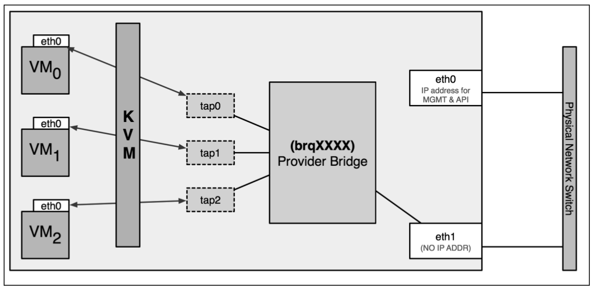

#####Virtual network devices

**Virtual network interfaces**

OpenStack uses the libvirt KVM/QEMU driver to provide platform virtualization in
default Nova confi gurations. When an instance is booted for the fi rst time, Neutron
assigns a virtual port to each network interface of the instance. KVM creates a virtual
network interface called a tap interface on the compute node hosting the instance.
The tap interface corresponds directly to a network interface within the guest
instance. Through the use of a bridge, the host can expose the guest instance to a
physical network.

In OpenStack, the name of a tap interface associated with an instance
corresponds to the Neutron port UUID, or unique identifi er, which the
instance is plugged into.


**Virtual network switches**

Neutron supports many types of virtual and physical switches and includes built-in
support for Linux bridges and Open vSwitch virtual switches.

A **Linux bridge** is a virtual switch on a host that connects multiple network
interfaces. When using Neutron, a bridge usually connects a physical interface to one
or more virtual or tap interfaces. A physical interface includes Ethernet interfaces,
such as eth1 , or bonded interfaces, such as bond0 . A virtual interface includes VLAN
interfaces, such as eth1.100 , as well as tap interfaces created by KVM. You can
connect multiple physical or virtual network interfaces to a Linux bridge.

The following diagram provides a high-level view of a Linux bridge leveraged by
Neutron:



In the figure, the **Linux bridge**, brqXXXX, is connected to a single physical interface,
eth1, and three virtual interfaces, tap0, tap1, and tap2. The three tap interfaces
correspond to a network interface within the respective guest instance. Traffi c from
eth0 in a virtual machine instance can be observed on the respective tap interface on
the host as well as on the bridge interface and the physical interface connected to the
bridge.

**Open vSwitch** operates as a software-based switch that uses virtual network bridges
and fl ow rules to forward packets between hosts. Most Neutron setups that leverage
Open vSwitch utilize at least three virtual switches or bridges, including a provider,
integration, and tunnel bridge. These virtual switches are cross connected with one
another, similar to how a physical switch may be connected to another physical
switch with a cross connect cable.

#####Configuring the bridge interface

In this instruction, the eth1 physical network interface will be utilized for bridging
purposes. On the controller and compute nodes, configure the eth1 interface within
the /etc/network/interfaces/eth1.cfg file, as follows:
```
    auto eth1
    iface eth1 inet manual
```    
Close and save the file and bring the interface up with the following command:
```
# ip link set dev eth1 up
or 
# ifup eth1
```
Confirm that the interface is in an UP state using the ip link show dev eth1:
```sh
# link show dev eth1
3: eth1: <BROADCAST,MULTICAST,UP,LOWER_UP> mtu 1500 qdisc pfifo_fast state UP group default qlen 1000
```

