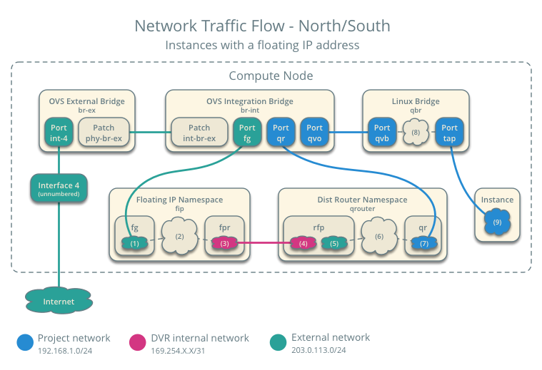

### Overview

Neutron Distributed Virtual Router implements the L3 Routers across the Compute Nodes, so that tenants intra VM communication 
will occur without hiting the Network Node. (East-West Routing)

Also Neutron Distributed Virtual Router implements the Floating IP namespace on every Compute Node where the VMs are located. 
In this case the VMs with FloatingIPs can forward the traffic to the External Network without reaching the Network Node. (North-South Routing)

But Neutron Distributed Virtual Router provides the legacy SNAT behavior for the default SNAT for all private VMs. 
SNAT service is not distributed, it is centralized and the service node will host the service. And this is bottleneck.


### Comparing routers

```
+=================================+==================================+
|      Legacy Router              |            DVR                   |
+=================================+==================================+
| NETWORK node provides:          | COMPUTE node provides:           |
|   * IP forwarding:              |   * IP forwarding for local VMS: |
|      - inter-subnet traffic     |      - inter-subnet traffic      |
|        between VMs              |        between VMs               |
|      - Floating-ip traffic      |      - Floating-ip traffic       |
|        between VMs and external |        between VMs and external  |
|      - default SNAT traffic     |                                  |
|        from VM to external      |                                  |
|   * Metadata Agent:             |   * Metadata Agent:              |
|      - access to Nova metadata  |      - access to Nova metadata   |
|        service                  |        service                   |
|                                 |                                  |
| ISSUES:                         | ADVANTAGES:                      |
|   - Performance bottleneck      |   - Bypass Network node improves |
|                                 |     performance                  |
|   - Scalability limitation      |   - Scales with Compute farm     |
|   - Single point of failure     |   - Limited failure domain       |
|                                 |     (per compute node)           |
|                                 |                                  |
|                                 | LIMITATION:                      |
|                                 |   - Dafaul SNAT function is      |
|                                 |     still centralized            |
+---------------------------------+----------------------------------+
```


### Traffic flow with DVR




**The following steps involve a packet inbound from the external network to an instance on compute node 1:**

1) The external interface forwards the packet to the Open vSwitch external bridge br-ex. The packet contains destination IP address F1.  
2) The Open vSwitch external bridge br-ex forwards the packet to the fg interface (1) in the floating IP namespace fip. The fg interface responds to any ARP requests for the instance floating IP address F1.  
3) The floating IP namespace fip routes the packet (2) to the distributed router namespace qrouter using DVR internal IP addresses DA1 and DA2. The fpr interface (3) contains DVR internal IP address DA1 and the rfp interface (4) contains DVR internal IP address DA2.  
4) The floating IP namespace fip forwards the packet to the rfp interface (5) in the distributed router namespace qrouter. The rfp interface also contains the instance floating IP address F1.  
5) The iptables service (6) in the distributed router namespace qrouter performs DNAT on the packet using the destination IP address. The qr interface (7) contains the project network gateway IP address TG.  
6) The distributed router namespace qrouter forwards the packet to the Open vSwitch integration bridge br-int.  
7) The Open vSwitch integration bridge br-int forwards the packet to the Linux bridge qbr.  
8) Security group rules (8) on the Linux bridge qbr handle firewalling and state tracking for the packet.  
9) The Linux bridge qbr forwards the packet to the instance tap interface (9).  


**The following steps involve a packet outbound from an instance on compute node 1 to the external network:**

1) The instance 1 tap interface (9) forwards the packet to the Linux bridge qbr. The packet contains destination MAC address TG1 because the destination resides on another network.  
2) Security group rules (8) on the Linux bridge qbr handle state tracking for the packet.  
3) The Linux bridge qbr forwards the packet to the Open vSwitch integration bridge br-int.  
4) The Open vSwitch integration bridge br-int forwards the packet to the qr interface (7) in the distributed router namespace qrouter. The qr interface contains the project network gateway IP address TG.  
5) The iptables service (6) performs SNAT on the packet using the rfp interface (5) as the source IP address. The rfp interface contains the instance floating IP address F1.  
6) The distributed router namespace qrouter (2) routes the packet to the floating IP namespace fip using DVR internal IP addresses DA1 and DA2. The rfp interface (4) contains DVR internal IP address DA2 and the fpr interface (3) contains DVR internal IP address DA1.  
7) The fg interface (1) in the floating IP namespace fip forwards the packet to the Open vSwitch external bridge br-ex. The fg interface contains the project router external IP address TE.  
8) The Open vSwitch external bridge br-ex forwards the packet to the external network via the external interface.  

**To sum up**

- on Compute node all VMs with FIP has one MAC-address for external world (MAC-address of virtual router's external port in namespace fip on specific Compute node)
- on Compute node Neutron answers on all ARP-requests IP which this node managed


### Configure Distributed Virtual Router (DVR)

1) Edit the ovs_neutron_plugin.ini file to change enable_distributed_routing to True:
```
enable_distributed_routing = True
l2_population = True
```
2) Edit the /etc/neutron/neutron.conf file to set the base MAC address that the DVR system uses for unique MAC allocation with the dvr_base_mac setting:
```
dvr_base_mac = fa:16:3f:00:00:00
```
3) Edit the /etc/neutron/neutron.conf file to set router_distributed to True.
```
router_distributed = True
```
4) Edit the l3_agent.ini file to set agent_mode to dvr on compute nodes for multi-node deployments:
```
agent_mode = dvr
```
On the Network node, configure dvr_snat on the distributed router: 
```
agent_mode = dvr_snat
```
5) When using a separate networking host, set agent_mode to dvr_snat. Use dvr_snat for Devstack or other single-host deployments also.
```
[ml2]
mechanism_drivers = openvswitch,l2population
```
6) In the [agent] section of the ml2_conf.ini file, set these configuration options to these values:
```
[agent]
l2_population = True
tunnel_types = vxlan
enable_distributed_routing = True
```
7) Restart the OVS L2 agent.
```
service neutron-openvswitch-agent restart
```

**Note!**
It is not currently possible to convert an existing non-distributed router to DVR. The router should instead be deleted and re-created as DVR


### DVR requirements

- You must use the ML2 plug-in for Open vSwitch (OVS) to enable DVR.
- Be sure that your firewall or security groups allows UDP traffic over the VLAN, GRE, or VXLAN port to pass between the compute hosts.


### DVR limitations

1) Distributed virtual router configurations work with the Open vSwitch Modular Layer 2 driver
2) In order to enable true north-south bandwidth between hypervisors (compute nodes), you must use public IP addresses for every compute node and enable floating IPs.
3) For now, based on the current neutron design and architecture, DHCP cannot become distributed across compute nodes. 
TODO(as): check 3rd point


### Links

1) http://docs.openstack.org/liberty/networking-guide/scenario-dvr-ovs.html

###FAQ

* How many **public** IP does DVR require without any FIP for VM?

    1 for snat router port in controller (network) node
    1 for fip router port in each compute node (this is not fip for VM)
     