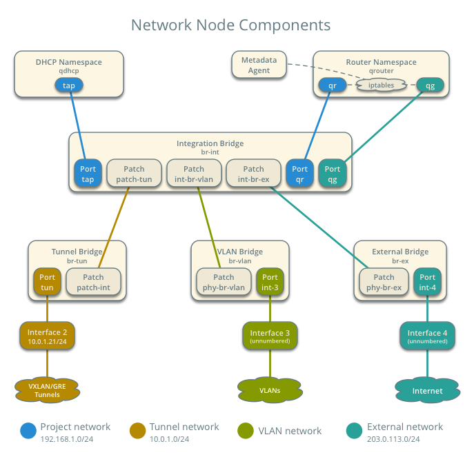
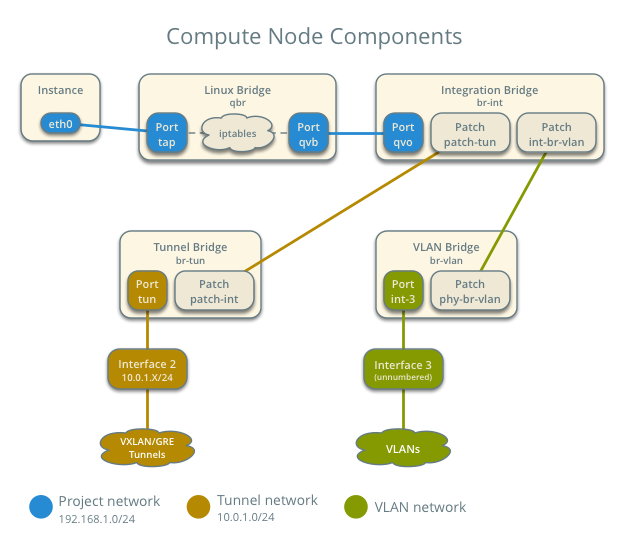
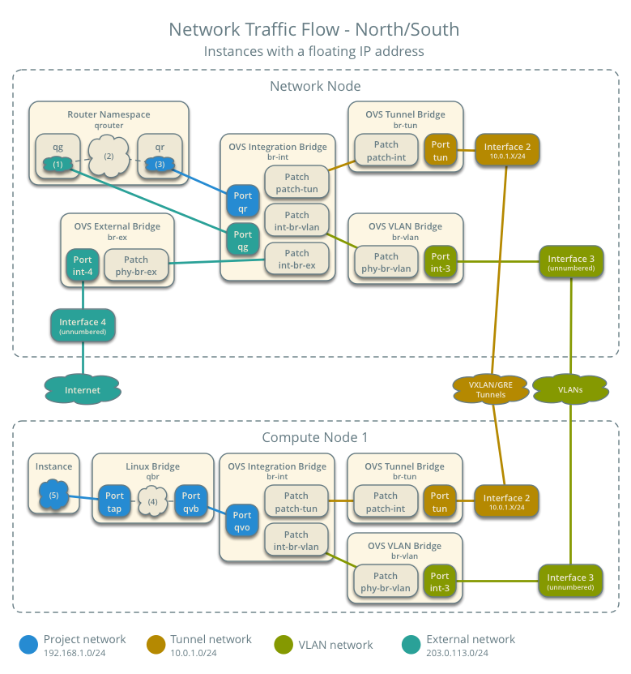
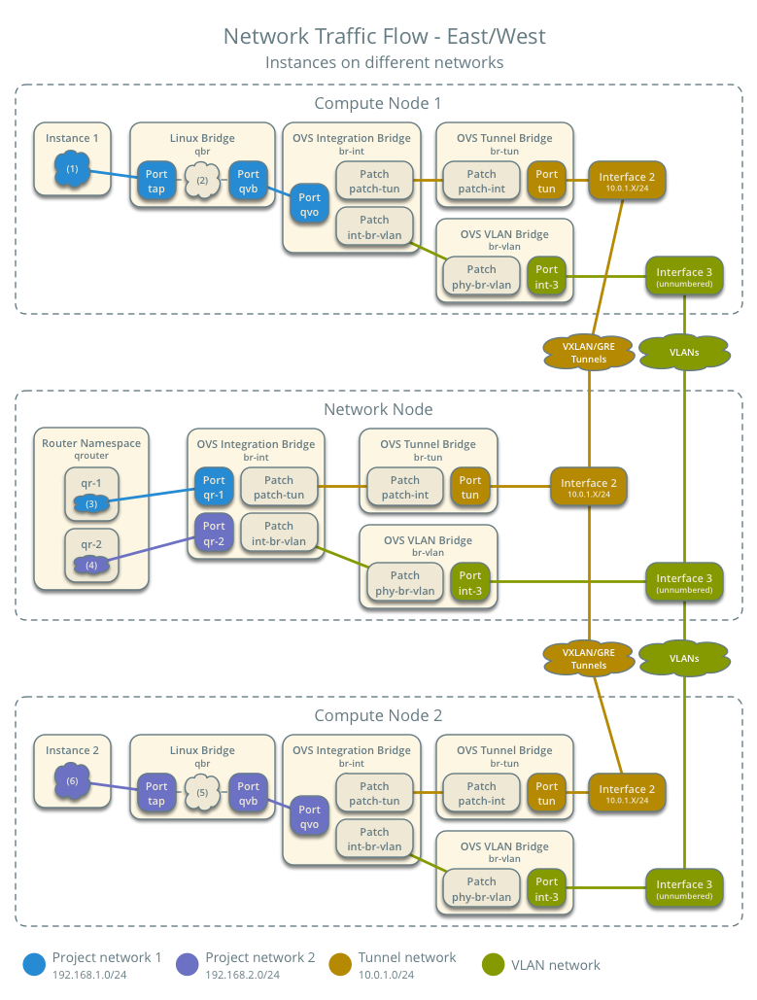
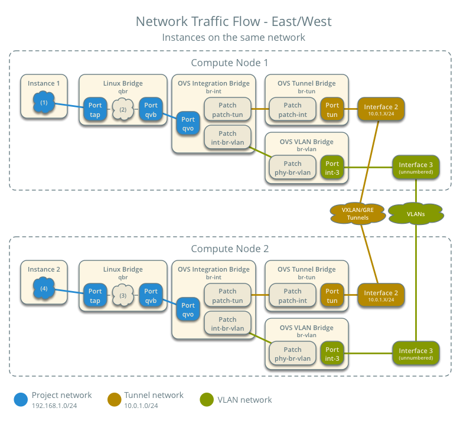

While the LinuxBridge and Open vSwitch agents and drivers can coexist
in the same environment, they should not be installed and confi gured
simultaneously on the same host.

#####Configuring the DHCP agent to use Open vSwitch

To properly connect the DHCP namespace tap interfaces to the integration bridge,
the DHCP agent must be confi gured to use the Open vSwitch interface driver.
Update the interface_driver confi guration option in the Neutron DHCP agent
confi guration fi le at /etc/neutron/dhcp_agent.ini on the controller node to use
the OVS interface driver using the following code:
```
[DEFAULT]
...
interface_driver = neutron.agent.linux.interface.OVSInterfaceDriver
```

#####ML2 confi guration options for Open vSwitch

Prior to ML2, the Open vSwitch plugin used its own confi guration file and options.
The [ovs] and [agent] option blocks are moved to the ML2 confi guration file, and
the most common options can be seen in the following code:
```
[ovs]
bridge_mappings
enable_tunneling
tunnel_type
integration_bridge
tunnel_bridge
local_ip
[agent]
tunnel_types
```

**Bridge mappings**

The **bridge_mappings** configuration option describes the mapping of an artificial
interface name or label to a network bridge confi gured on the server. Unlike the
LinuxBridge plugin that confi gures multiple bridges containing individual VLAN or
VXLAN interfaces, the Open vSwitch plugin uses a single bridge interface containing
a single physical interface and fl ow rules to add, modify, or remove VLAN headers if
necessary.

When networks are created, they are associated with an interface label, such as
physnet1 . The physnet1 label is then mapped to a bridge, such as br-eth1 , which
contains the eth1 physical interface. The mapping of the label to the bridge interface
is handled by the bridge_mappings option. This mapping can be observed as
follows:
```
bridge_mappings = physnet1:br-eth1
```
The label itself must be consistent between all nodes in the environment. However,
the bridge interface mapped to the label as well as the interface in the bridge itself,
may be different. A difference in mappings is often observed when one node maps
physnet1 to a bridge interface capable of 1 gigabit and another maps physnet1 to a
bridge interface capable of 10 gigabits.

More than one interface mapping is allowed and can be added to the list using a
comma as a separator, as seen in the following example:
```
bridge_mappings = physnet1:br-eth1,physnet2:br-eth2
```
In this installation, physnet2 will be used as the interface label and be mapped to the
br-eth2 bridge. Update the ML2 confi guration fi le at /etc/neutron/plugins/ml2/
ml2_conf.ini accordingly on all hosts by executing the following code:
```
[OVS]
...
bridge_mappings = physnet2:br-eth2
```

**Enable tunneling**

To enable support for GRE and VXLAN, the enable_tunneling confi guration
option must be set to true.
```
[OVS]
...
enable_tunneling = true
```

**Tunnel type**

The tunnel_type confi guration option specifi es the type of tunnel to use when
utilizing tunnels. The two available options are gre and/or vxlan .
To enable only GRE tunnels, set tunnel_type to gre in the [OVS] section of the ML2
confi guration file:
```
[OVS]
...
tunnel_type = gre
```
To enable only the VXLAN tunnels, set tunnel_type to vxlan in the [OVS] section
of the ML2 confi guration file:
```
[OVS]
...
tunnel_type = vxlan
```
To enable both GRE and VXLAN tunnels, specify both tunnel types separated by a
comma:
```
[OVS]
...
tunnel_type = vxlan,gre
```

**Local IP**

The local_ip confi guration option specifi es the local IP address on the node that
will be used to build the VXLAN overlay between hosts when enable_vxlan is set
to true .

Update the local_ip confi guration option in the [vxlan] section of the ML2
confi guration file accordingly on all hosts.
On each controller, compute node, use the specific ip-address:
```
[vxlan]
...
local_ip = 192.168.0.2
```

Change 192.168.0.2 to current ip address of specific node.

**Tunnel types**

The **tunnel_types** configuration option specifies the types of tunnels supported by
the agent. The two available options are gre and/or vxlan. If left unconfigured, the
default value is gre when enable_tunneling is set to true. If you are using only
vxlan , set this option to vxlan .
Update the tunnel_types confi guration option in the [agent] section of the ML2
confi guration fi le accordingly on all hosts:
```
[agent]
tunnel_types = vxlan,gre
```


**NOTE!**

**Integration bridge**

The **integration_bridge* configuration option specifies the name of the integration
bridge used on each node. There is a single integration bridge per node that acts
as the virtual switch where all virtual machine VIFs, otherwise known as virtual
network interfaces, are connected. The default name of the integration bridge is br-
int and should not be modified.
The Open vSwitch agent automatically creates the integration bridge the fi rst time the agent
service is started. You do not need to add an interface to the integration
bridge as Neutron is responsible for connecting network devices to this
virtual switch.

**Tunnel bridge**

The **tunnel bridge** is a virtual switch, which is similar to the integration and
provider bridges, and is used to connect the GRE and VXLAN tunnel endpoints.
Flow rules exist on this bridge that are responsible for properly encapsulating and
decapsulating tenant traffi c as it traverses the bridge.
The tunnel_bridge confi guration option specifi es the name of the tunnel bridge.
The default value is br-tun and should not be modifi ed. It is not necessary to create
this bridge manually as Neutron does it automatically.


#####Restarting services to enable the Open vSwitch plugin

Now that the appropriate OpenStack confi guration fi les have been modifi ed to use
Open vSwitch as the networking driver, certain services must be started or restarted
for the changes to take effect.
The Open vSwitch network agent should be restarted on all nodes; the following
code needs to be executed:
```
# service neutron-plugin-openvswitch-agent restart
```
The following services should be restarted on the controller node:
```
# service nova-api restart
# service neutron-server restart
# service neutron-dhcp-agent restart
```
The following service should be restarted on the compute nodes:
```
# service nova-compute restart
```


#####Verifying Open vSwitch agents

To verify that the Open vSwitch network agents on all nodes have properly checked
in, issue the neutron agent-list command on the controller node:
```
# neutron agent-list
+--------------------------------------+--------------------+-----------------------------------------+-------------------+-------+----------------+---------------------------+
| id                                   | agent_type         | host                                    | availability_zone | alive | admin_state_up | binary                    |
+--------------------------------------+--------------------+-----------------------------------------+-------------------+-------+----------------+---------------------------+
| 3466303f-a7df-4194-99eb-61aef2b7ec68 | DHCP agent         | node1-neutron-agents-container-b635f114 | nova              | :-)   | True           | neutron-dhcp-agent        |
| 4a971c63-3906-4e6c-8599-494c748c8a9a | Metadata agent     | node1-neutron-agents-container-b635f114 |                   | :-)   | True           | neutron-metadata-agent    |
| 57e13ad5-5e6e-4bd0-b532-228afaa7286e | Metering agent     | node1-neutron-agents-container-b635f114 |                   | :-)   | True           | neutron-metering-agent    |
| 5cf1c43f-9fea-4920-840c-04e594e0d43e | Metadata agent     | ubuntu                                  |                   | :-)   | True           | neutron-metadata-agent    |
| 868ae4c0-dc93-4346-9a64-18d492242546 | Open vSwitch agent | ubuntu                                  |                   | :-)   | True           | neutron-openvswitch-agent |
| c88a45d8-1c11-4eec-aa69-07bb1127421a | L3 agent           | node1-neutron-agents-container-b635f114 | nova              | :-)   | True           | neutron-l3-agent          |
| c9d868fd-fd7b-453f-b47d-ded962b85fa3 | L3 agent           | ubuntu                                  | nova              | :-)   | True           | neutron-l3-agent          |
+--------------------------------------+--------------------+-----------------------------------------+-------------------+-------+----------------+---------------------------+

```
The Open vSwitch agents on the controller and compute nodes should be visible in
the output with a smiley face under the alive column. If a node is not present or the
status is XXX , troubleshoot agent connectivity issues by observing the log messages
found in /var/log/neutron/openvswitch-agent.log on the respective host.


### Network Components with OVS





##### Network flow to/from internet with floating IP



##### Network flow between instances in different tenant networks



##### Network flow between instances in same tenant network




### Links

1. https://docs.openstack.org/liberty/networking-guide/scenario-classic-ovs.html