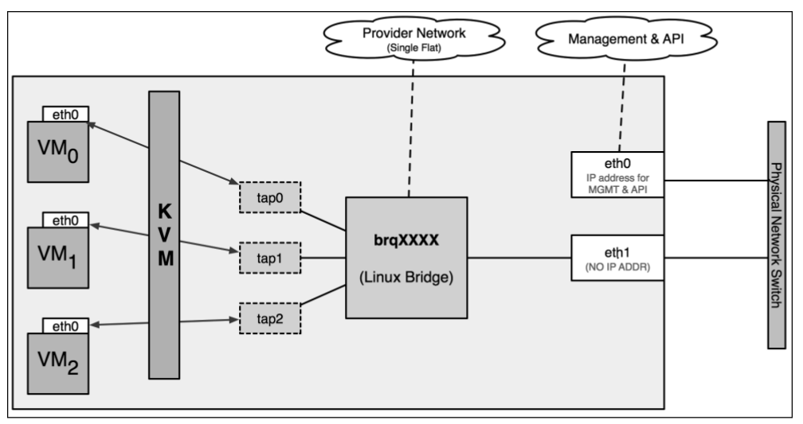
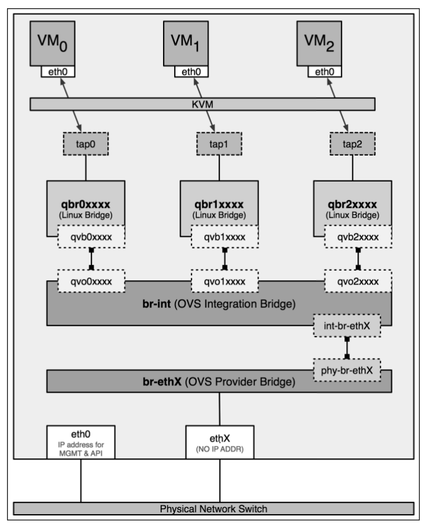

#####Virtual network devices

**Virtual network interfaces**

OpenStack uses the libvirt KVM/QEMU driver to provide platform virtualization in
default Nova confi gurations. When an instance is booted for the fi rst time, Neutron
assigns a virtual port to each network interface of the instance. KVM creates a virtual
network interface called a tap interface on the compute node hosting the instance.
The tap interface corresponds directly to a network interface within the guest
instance. Through the use of a bridge, the host can expose the guest instance to a
physical network.

In OpenStack, the name of a tap interface associated with an instance
corresponds to the Neutron port UUID, or unique identifi er, which the
instance is plugged into.


**Virtual network switches**

Neutron supports many types of virtual and physical switches and includes built-in
support for Linux bridges and Open vSwitch virtual switches.

A **Linux bridge** is a virtual switch on a host that connects multiple network
interfaces. When using Neutron, a bridge usually connects a physical interface to one
or more virtual or tap interfaces. A physical interface includes Ethernet interfaces,
such as eth1 , or bonded interfaces, such as bond0 . A virtual interface includes VLAN
interfaces, such as eth1.100 , as well as tap interfaces created by KVM. You can
connect multiple physical or virtual network interfaces to a Linux bridge.

The following diagram provides a high-level view of a Linux bridge leveraged by
Neutron:


In the figure, the **Linux bridge**, brqXXXX, is connected to a single physical interface,
eth1, and three virtual interfaces, tap0, tap1, and tap2. The three tap interfaces
correspond to a network interface within the respective guest instance. Traffi c from
eth0 in a virtual machine instance can be observed on the respective tap interface on
the host as well as on the bridge interface and the physical interface connected to the
bridge.

**Open vSwitch** operates as a software-based switch that uses virtual network bridges
and fl ow rules to forward packets between hosts. Most Neutron setups that leverage
Open vSwitch utilize at least three virtual switches or bridges, including a provider,
integration, and tunnel bridge. These virtual switches are cross connected with one
another, similar to how a physical switch may be connected to another physical
switch with a cross connect cable.

In a **LinuxBridge-based network** implementation, there are fi ve types of interfaces
managed by Neutron, which are:

- Tap interfaces
- Physical interfaces
- VLAN interfaces
- VXLAN interfaces
- Linux bridges

In an **Open vSwitch-based network** implementation, there are fi ve distinct types of
virtual networking devices:

- Tap devices
- Linux bridges
- Virtual Ethernet cables
- OVS bridges
- OVS patch ports


#####Using the L2 population driver

The L2 population driver enables broadcast, multicast, and unicast traffic to scale out on large
overlay networks.
The L2 population driver works to prepopulate bridge-forwarding tables on all hosts
to eliminate normal switch learning behaviors as broadcasts through an overlay
network are costly operations due to encapsulation. As Neutron is seen as the source
of truth for the logical layout of networks and instances created by tenants, it can
easily prepopulate forwarding tables consisting of MAC addresses and destination
hosts with this information. The L2 population driver also implements an ARP proxy
on each host, eliminating the need to broadcast ARP requests across the overlay
network. Each node is able to intercept an ARP request from an instance or router
and proxy the response to the requestor.


#####Connectivity issues when using overlay networks

One thing to be aware of when using overlay networking technologies is that
the additional headers added to the packets may cause the packet to exceed the
maximum transmission unit, or MTU. The MTU is the largest size of packet or
frame that can be sent over a network. Encapsulating a packet with VXLAN headers
may cause the packet size to exceed the default maximum, which is 1500 bytes.
Connection issues caused by exceeding the MTU manifest themselves in strange
ways; they can be seen in partial failures in connecting to instances over SSH or
in a failure to transfer large payloads between instances, among others. Consider
lowering the MTU of interfaces within virtual machine instances from 1500 bytes
to 1450 bytes to account for the overhead of VXLAN encapsulation so as to avoid
connectivity issues.

The DHCP agent and dnsmasq can be configured to push a lower MTU to instances
within the DHCP lease offer. To configure a lower MTU, complete the following
steps:

1. On the controller node, modify the DHCP confi guration fi le at /etc/
neutron/dhcp_agent.ini and specify a custom dnsmasq confi guration fi le,
as follows:
```
[DEFAULT]
dnsmasq_config_file = /etc/neutron/dnsmasq-neutron.conf
```

2. Next, create the custom dnsmasq confi guration fi le at /etc/neutron/
dnsmasq-neutron.conf and add the following contents:
```
dhcp-option-force=26,1450
```

3. Save and close the file. Restart the Neutron DHCP agent with the following
command:
```
# service neutron-dhcp-agent restart
```
When the instances are later created, the MTU can be observed within the instance
using the `ip link show <interface>` command.


In a **LinuxBridge-based network** implementation, there are fi ve types of interfaces
managed by Neutron, which are:

- Tap interfaces
- Physical interfaces
- VLAN interfaces
- VXLAN interfaces
- Linux bridges

In an **Open vSwitch-based network** implementation, there are fi ve distinct types of
virtual networking devices:

- Tap devices
- Linux bridges
- Virtual Ethernet cables
- OVS bridges
- OVS patch ports


####Visualizing the traffic flow when using Linux Bridge



While an Ethernet frame travels from the virtual machine instance to a remote
physical network, it passes through three or four of the following devices depending
on the network type:

- The tap interface: tapN
- The Linux bridge: brqXXXX
- The VXLAN interface: vxlan-Z (where z is the VNI)
- The VLAN interface: ethX.Y (where X is the interface and Y is the VLAN ID)
- The physical interface: ethX (where X is the interface)

See all bridges and connected interfaces:

```sh
# brctl show
```


####Visualizing the traffic flow when using Open vSwitch



When using the Open vSwitch driver, for an Ethernet frame to travel from the virtual
machine instance out through the physical server interface, it will potentially pass
through nine devices inside the host:

- The tap interface: tapXXXX
- The Linux bridge: qbrXXXX
- The veth pair: qvbXXXX , qvoXXXX
- The OVS integration bridge: br-int
- OVS patch ports: int-br-ethX and phy-br-ethX
- The OVS provider bridge: br-ethX
- The physical interface: ethX
- The OVS tunnel bridge: br-tun

The Open vSwitch bridge br-int is known as the integration bridge. The
integration bridge is the central virtual switch that most virtual devices are
connected to, including instances, DHCP servers, routers, and more. When Neutron
security groups are enabled, however, instances are not directly connected to the
integration bridge. Instead, instances are connected to individual Linux bridges that
are cross connected to the integration bridge using a veth cable.

See all bridges and connected interfaces:
```sh
# ovs-vsctl show
```

To see state of port connected to specific bridge:
```sh
# ovs-ofct show br-int
```


#####FAQ

1. Can Neutron use Linux bridge and Open vSwitch simultaneously?

    Yes, Neutron can, but only on different nodes, not on one. Each plugin option need to be configured on each 
    node in `/etc/neutron/plugins/ml2/ml2_conf.ini`  
```
[ml2]
mechanism_drivers = openvswitch
```
or
```
[ml2]
mechanism_drivers = lbx
```

2. What is '169.254.169.254' address in qroute/qdhcp ip namespace?
 
    This is ip of neutron proxy which forward packets to nova metadata server.


    
    
