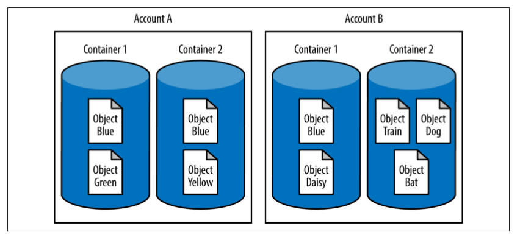

#### Swift’s key characteristics include:

Scalablity

    Swift is designed to scale linearly based on how much data needs to be stored and
    how many users need to be served. This means that it can scale from a few nodes
    with a handful of drives to thousands of machines with dozens, even hundreds, of
    petabytes of storage. As the system grows in usage and the number of requests
    increase, performance doesn’t degrade, in part because Swift is designed to be scal‐
    13able with no single point of failure. To scale up, the system grows where needed—
    by adding storage nodes to increase storage capacity, adding proxy nodes as requests
    increase, and growing network capacity where bottlenecks are detected.

Durability

    Swift’s innovative distributed architecture means that it provides extremely durable
    storage. The essence of durability is that stored objects will always be available and
    have data integrity. To ensure an object is persistently available, Swift copies it and
    distributes the copies across the cluster. Auditing processes run, verifying that data
    is still good. Replicators run to ensure that the correct number of copies are in the
    cluster. In the event that a device fails, missing data copies are replicated and placed
    throughout the cluster to ensure that durability levels are maintained.

Multi-regional capability

    Swift can distribute data across multiple data centers, which may have high latency
    between them. Distribution can be done for a number of reasons. One would be to
    provide high availability of data by allowing it to be accessed from each region.
    Another reason would be to designate one region as a disaster recovery site.
    Swift does this by allowing operators to define regions and zones within a cluster.
    Regions generally specify geographic boundaries, such as data centers in different
    cities. Zones are portions of regions that define points of failure for groups of ma‐
    chines, such as a rack where all the nodes are on one power source going to the
    same switch. The use of regions and zones ensures that Swift places copies across
    the cluster in a way that allows for failures. It enables a cluster to survive even if a
    zone is unavailable. This provides additional guarantees of durability and availa‐
    bility of data.

High concurrency

    Swift is architected to distribute requests across multiple servers. By using a shared-
    nothing approach, Swift can take advantage of all the available server capacity to
    handle many requests simultaneously. This increases the system’s concurrency and
    total throughput available. This is a great advantage to those who need to satisfy
    the storage needs of large-scale web workloads.

Flexible storage

    Swift offers great flexibility in data architecture and hardware, allowing operators
    to tailor their storage to meet the specific needs of their users. In addition to the
    ability to mix and match commodity hardware, Swift has storage polices that allow
    operators to use hardware in a way that best handles the constraints of various
    situations. For example, need higher performance for some data? Create a storage
    policy that only uses the SSDs in the cluster. Need data to be available across the
    globe? Create a storage policy that encompasses data centers across the world. Need
    data to be in a particular country? Create a policy that will place data only in that
    region.
    Swift’s underlying storage methods are also very flexible. Its pluggable architecture
    allows the incorporation of new storage systems. Typically, direct-attached storage
    devices are used to build a cluster, but emerging technology (such as key/value
    Ethernet drives from Seagate) and other open source and commercial storage sys‐
    tems that have adaptors can become storage targets in a Swift cluster.

Open source

    Swift is open-sourced under the Apache 2 license as part of the OpenStack project.
    With more than 150 participating developers as of early 2014, the Swift community
    is growing every quarter. As with other open source projects, source code can be
    reviewed by many more developers than is the case with proprietary software. This
    means potential bugs tend to be more visible and are more rapidly corrected than
    with proprietary software. In the long term, “open” generally wins.
    
Large ecosystem

    The Swift ecosystem is powered by open source code, but unlike some open source
    projects, it is a large ecosystem with multiple companies that test and develop Swift
    at scale. Having so many vendors participating greatly reduces the risk of vendor
    lock-in for users. The large number of organizations and developers participating
    in the OpenStack project means that the development velocity and breadth of tools,
    utilities, and services for Swift is great and will only increase over time. Many tools,
    libraries, clients, and applications already support Swift’s API and many more are
    in the works. With such a vibrant and engaged ecosystem, it is easy to obtain tools,
    best practices, and deployment know-how from other organizations and commu‐
    nity members who are using Swift.
    
Runs on commodity hardware

    Swift is designed from the ground up to handle failures, so reliability of individual
    components is less critical. Swift installations can run robustly on commodity
    hardware, and even on regular desktop drives rather than more expensive enter‐
    prise drives. Companies can choose hardware quality and configuration to suit the
    tolerances of the application and their ability to replace failed equipment.
    Swift’s ability to use commodity hardware means there is no lock-in with any par‐
    ticular hardware vendor. As a result, deployments can continually take advantage
    of decreasing hardware prices and increasing drive capacity. It also allows data to
    be moved from one media to another to address constraints such as IO rate or
    latency.
    
Developer-friendliness

    Developers benefit from the rich and growing body of Swift tools and libraries.
    Beyond the core functionality to store and serve data durably at large scale, Swift
    has many built-in features that make it easy for application developers and users.
    Features that developers might find useful include:

    Static website hosting
        Users can host static websites, which support client-side JavaScript and CSS
        scripting, directly from Swift. Swift also supports custom error pages and auto-
        generated listings.
    Automatically expiring objects
        Objects can be given an expiration time after which they are no longer available
        and will be deleted. This is very useful for preventing stale data from circulating
        and to comply with data retention policies.
    Time-limited URLs
        URLs can be generated that are valid for only a limited period of time. These
        URLs can prevent hotlinking or enable temporary write permissions without
        needing to hand out full credentials to an untrusted party.
    Quotas
        Storage limits can be set on containers and accounts.
    Upload directly from HTML forms
        Users can generate web forms that upload data directly into Swift so that it
        doesn’t have to be proxied through another server.
    Versioned writes
        Users can write a new version of an object to Swift while keeping all older
        versions.
    Support for chunked transfer encoding
        Users can upload data to Swift without knowing ahead of time how large the
        object is.
    Multirange reads
        Users can read one or more sections of an object with a single read request.
    Access control lists
        Users can configure access to their data to give or deny others the ability to read
        or write the data.
    Programmatic access to data locality
        Deployers can integrate Swift with systems such as Hadoop and take advantage
        of locality information to lower network requirements when processing data.
    Customizability
        Middleware can be developed and run directly on the storage system.

Operator-friendly

    Swift is appealing to IT operators for a number of reasons. It lets you use low-cost,
    industry-standard servers and disks. With Swift, you can manage more data and
    use cases with ease. Because an API is used to store and serve data, you do not spend
    time managing volumes for individual projects. Enabling new applications is easy
    and quick. Finally, Swift’s durable architecture with no single point of failure lets
    you avoid catastrophic failure and rest a bit easier. The chapters in this book on
    deploying and operating Swift clusters will provide you with an overview of how
    easy it really is.
    
Upcoming features

    The Swift developer community is working on many additional features that will
    be added to upcoming releases of Swift, such as storage policies and support for
    erasure coding. Storage policies will allow deployers and users to choose what
    hardware data is on, how the data is stored across that hardware, and in which
    region the data resides. The erasure coding support in Swift will enable deployers
    to store data with erasure coding instead of (or in addition to) Swift’s standard
    replica model. The design goal is to be able to have erasure-coded storage plus
    replicas coexisting in a single Swift cluster. This will allow a choice in how to store
    data and will allow applications to make the right trade-offs based on their use.
    

#### SwiftStack features
 
SwiftStack features include:

• Built-in load balancer

• SSL termination for HTTPS services

• Disk management tools

• Swift ring building and ring deployment

• Automated gradual capacity adjustments

• Health-check and alerting agents

• Node/drive replacement tools

• System monitoring and stats collection

• Capacity monitoring and trending

• Web client / user portal

Additional information on SwiftStack is available at the SwiftStack site.

#### Swift Data Model

OpenStack Swift allows users to store unstructured data objects with a canonical name
containing three parts: account, container, and object. Using one or more of these parts
allows the system to form a unique storage location for data.

/account

    The account storage location is a uniquely named storage area that will contain the
    metadata (descriptive information) about the account itself, as well as the list of
    containers in the account. Note that in Swift, an account is not a user identity. When
    you hear account, think storage area.
    
/account/container

    The container storage location is the user-defined storage area within an account
    where metadata about the container itself and the list of objects in the container
    will be stored.
    
/account/container/object

    The object storage location is where the data object and its metadata will be stored.
    Because the parts are joined together to make up the locations, the container and object
    names do not need to be unique within the cluster. If three objects with the name
    ObjectBlue are uploaded to different containers or accounts, each one has a unique
    storage location, as shown in the figure below. The storage locations for the three objects are:
        /AccountA/Container1/ObjectBlue
        /AccountA/Container2/ObjectBlue
        /AccountB/Container1/ObjectBlue

