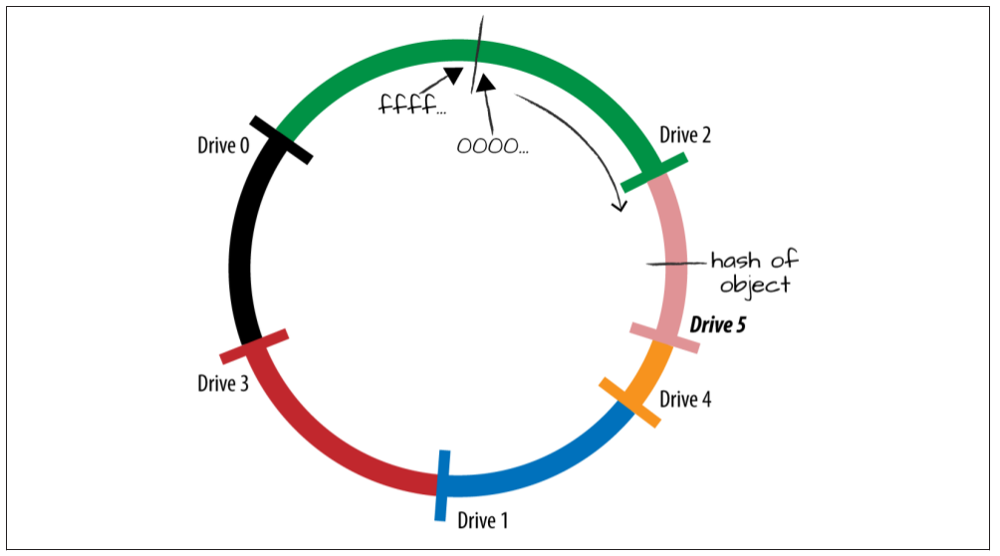

#### Locating the Data

With data for accounts, containers, and objects distributed across multiple nodes in the
cluster, you might wonder how on earth these system components and services find any
one piece of data in the cluster!
The short answer is that when a process on a node needs to find a piece of account,
container, or object data, it goes to the local copy of the rings and looks up all the locations
for that data on the account ring, the container ring, or one of the object rings. Swift
stores multiple copies of each piece of data, so looking up where data is stored results
in finding multiple locations. The process can then query the locations for the data.
The longer, more technical answer requires discussing what the rings are. Rings are a
set of lookup tables distributed to every node in the cluster. Swift uses a modified version
of consistent hashing for its rings. To understand the rings and how they are used for
data placement, we will first look at hash functions and consistent hashing rings. After
that, we will look at Swift’s modified consistent hashing ring and how Swift rings are
created.
To get started, let’s talk about hashing. A real-world example of hashing occurs when
you use a printed encyclopedia set. When you look up information in an encyclopedia,
you shorten the information you need to just the first few letters (a basic form of hashing)
and select that volume from the set based on the letter range that is visible on the spine.
For example, if you are looking up greyhounds, you would select the GOL - JYO volume.
Looking only at the first few letters of a word is a very simple hash function. Although
it is effective for encyclopedias, we will need more sophisticated hash functions when
storing data on multiple drives.


####Ring Basics: Hash Functions

Before we take a closer look at consistent hashing in Swift, let’s cover basic hashing by
looking at how we can use a hash function to determine where to store objects. Hashing
can be thought of as a method that takes a long string of data and generates a shorter
fixed-length reference for it. A key point about this method is that it always returns the
same results. With our encyclopedia example, no matter how many times you check the
encyclopedia set for information about greyhounds, you will always be checking the
GOL - JYO volume.

A relatively simple method of determining where to store an object would be to use the
MD5 algorithm to get the hash of the object’s storage location and then divide the hash
value by the number of drives available for storage to get the remainder. The value of
the remainder would map to a drive ID.
We did say relatively simple.

To make this clearer, let’s look at an example. Let’s name the object storage location /
account/container/object and use four drives for storage, which we’ll call Drive 0 through
Drive 3. If we had only two drives to store data on, we could get away with just putting
objects with even hashes on one drive and odd hashes on the other. However, things get
more complicated with three or more drives. Here we take the remainder (a modulo
function) so we always get a number that will be equal to or less than the number of
drives and allows the object placement to be somewhat even.

We start by using the MD5 function to get the hash of the storage location:
```commandline
md5 -s /account/container/object
MD5 ("/account/container/object") = f9db0f833f1545be2e40f387d6c271de
```
Then we divide the hash result (a hexadecimal numerical value) by the number of drives,
and find the remainder (the whole number left over from division).

While we applaud all those who can do hexadecimal division in their heads, let’s make
this easier for everyone by converting the hexadecimal value to decimal (the result is
332115198597019796159838990710599741918). Now we divide the hash value by the
number of drives and determine the remainder. This function, the modulo operation,
is represented in most programming languages by the % operator:
    
    332115198597019796159838990710599741918 % 4 = 2
    
Because the remainder was 2, the object would be stored on Drive 2.
The biggest drawback to this kind of hashing function is that the calculation depends
on dividing by the number of drives. Any time a drive is added or removed (a capacity
change), that object would likely have a different remainder, which would map to a
different drive. To demonstrate this, the following table shows which drive the object
would be stored on as more drives are added. The hash of the object’s storage location
remains the same throughout.
```
Table - Which drive the object will be stored on
----------------------------------------------------
| Total drive count | Remainder        | Maps to   |
----------------------------------------------------
|   6               |  (hash) % 6 = 4  |  Drive 4  |
|   7               |  (hash) % 7 = 6  |  Drive 6  |
|   8               |  (hash) % 8 = 6  |  Drive 6  |
|   9               |  (hash) % 9 = 1  |  Drive 1  |
|   10              |  (hash) % 10 = 8 |  Drive 8  |
```

Notice that the object would have to be moved to a different drive almost every time a
new drive is added or removed. This recalculation would need to happen for all data in
the cluster and would result in the majority of the data being moved to different drives
after a capacity change. The cluster would then have to spend resources making those
moves, generating heavy network traffic, and data unavailability.


#### Ring Basics: Consistent Hashing Ring

Consistent hashing helps minimize the number of objects that move when capacity is
added to or removed from a cluster. Instead of mapping each value directly to one drive,
a range of values is associated with one drive. This is done by mapping all the possible
hash values around a circle. Each drive is then assigned to a point on the circle based
on a hash value for the drive. Although different methods can be used (hash of the drive’s
IP address, hash of part of the drive’s name, etc.), the result is that all the drives are
placed in a fairly random order around the ring, as shown in Figure 1.

When an object needs to be stored, the object’s hash is determined and then located on
the circle. The system will then do a search clockwise around the circle to locate the
nearest drive marker. This will be the drive where the object is placed. In Figure 1 you
can see that the object would be stored on Drive 4. To make it easier for us to see which
drive an object will be placed on after the system does its search, we marked the range
of hashes that “belong” to a drive.


Figgure 1. Drives and the hashing ring

With this hashing ring in place, you can add a drive or remove a drive and only a few
objects will be moved. When a drive is added to the circle, the next drive clockwise from
it will lose any objects whose hash is on the part of the hash range that now belongs to
the new drive. Those objects will be copied over to the new drive. The rest of the objects,
however, will not be disturbed. This is much more efficient than our original example,
where nearly all the objects moved around.

To better visualize this, let’s add a new drive, Drive 5, to our diagram. The nearest drive
clockwise to it, in this case Drive 4, would give up all objects whose hash values match
what is now part of the new drive’s range. So the object that was on Drive 4 would now
be moved to Drive 5 (Figure 2)


Figgure 2. New drive added to a ring

Up to now we’ve been using a simplified version of a consistent hashing ring, with only
one marker per drive in order to more clearly show what is happening. In practice, there
are multiple markers placed around the circle for each drive. On most consistent hashing
rings there would be significantly more markers, even hundreds, per drive placed on
the ring. This would be difficult to show on a diagram, so we have added only a few
extra markers to show the concept. These multiple markers mean that a drive maps to
several small ranges of hash values instead of one big one (Figure 3). This scheme has
two effects: a new drive will gain objects from more than one drive and the overall
placement of objects will be fairly even.

When a new drive is added, it maps to several small hash ranges around the ring and
each of the neighbor drives on the ring will give up the objects in those ranges. Moving
a smaller number of objects from several different drives keeps data placement more
even across all drives.


Figgure 3. Many ranges for each drive


#### The Rings: Modified Consistent Hashing Ring

At the beginning of our discussion on locating data, we noted that Swift uses a modified
consistent hashing ring. These modifications create a partitioned consistent hashing
ring that uses replica count, replica lock, and data distribution mechanisms such as drive
weight and unique-as-possible placement to build the individual Swift rings. One ac‐
count ring will be generated for a cluster and be used to determine where the account
data is located. One container ring will be generated for a cluster and used to determine
where the container data is located. One object storage policy ring will be created for
each storage policy in use and used to determine where object data is located.


###### Partitions

With an unmodified consistent hashing ring, there are numerous small hash ranges that
become smaller or larger when drives are added or removed. This churn can result in
objects not being available as they are moved during capacity changes.
To prevent this, Swift approaches the hashing ring differently. Although the ring is still
divided up into numerous small hash ranges, these ranges are all the same size and will
not change in number. These fixed-width partitions are then assigned to drives using a
placement algorithm.

Let’s take a closer look at how partitions are calculated and how drives are assigned to
them.

**Partition power**

The total number of partitions that can exist in your cluster is calculated using the
partition power, an integer randomly picked during cluster creation.
The formula to calculate the total number of partitions in a cluster is:
    
    total partitions in cluster = 2^partition power
    
For example, if a partition power of 15 is chosen, the number of partitions your cluster
will have is 2 15 = 32,768. Those 32,768 partitions are then mapped to the available drives.
Although the number of drives might change in a cluster, the number of partitions will
not.

**Replica count**

When a Swift ring is built, the replica count value is how many copies of each partition
will be placed across the cluster. For example, if you have a replica count of three, then
each partition will be replicated for a total of three copies. Each of the three replicas will
be stored on a different device in the cluster for redundancy. When an object is put into
the cluster, its hash will match a partition and be copied to all three locations of that
partition.

The more replicas you have, the better protected you are against losing data when there
is a failure (particularly if you distribute replicas across data centers and geographic
regions). The replica count is set to a real number, most often to an integer such as 3.0.
In the less common instance where a non-integer replica count is used, a percentage of
the partitions will have one additional replica; for instance, a 3.15 replica count means
that 15% of the drives will have one extra replica for a total of four. The main reason
you might use a fractional replica count would be to make a gradual shift from one
integer replica count to another, allowing Swift time to copy the extra data without
saturating the network.

Partition replication includes designating handoff drives. This means that when a drive
fails, the replication/auditing processes will notice and push the data to handoff loca‐
tions. This dramatically reduces the MTTR (mean time to repair) compared to standard
three-way mirroring or RAID. The probability that all replicated partitions across the
system will become corrupt (or otherwise fail) before the cluster notices and is able to
push the data to handoff locations is very small, which is another reason we say that
Swift is durable. Depending on the durability guarantees you require and the failure
analysis of your storage devices, you can set the replica count appropriately to meet your
needs.

**Replica locks**

While a partition is being moved, Swift will lock that partition’s replicas so that they are
not eligible to be moved in order to ensure data availability. Locks are used both when
the rings are being updated as well as operationally when data is moved. The exact length
of time to lock the partition is set by the min_part_hours configuration option.


#### Distribution of Data

In addition to using the modified ring structure, Swift has two other mechanisms to
distribute data evenly:

Weight

    Swift uses a value called weight for each drive in the cluster. This user-defined value,
    set when the drive is added, is the drive’s relative weight compared to the other
    drives in the ring. The weight helps the cluster calculate how many partitions should
    be assigned to the drive. The higher the weight, the greater number of partitions
    Swift should assign to the drive.

Unique-as-possible

    To ensure the cluster is storing data evenly across its defined spaces (regions, zones,
    nodes, and disks), Swift places partitions using an algorithm called unique-as-
    possible. The algorithm identifies the least-used region, then zone, then server
    (IP:port), and then, if necessary, the least-used disk, and then places the partition
    there. The “least-used” formula also attempts to place the partition replicas as far
    from each other as possible.
    This calculated placement gives deployers the flexibility to organize their infra‐
    structure as they choose and configure Swift to take advantage of what has been
    deployed, rather than forcing the deployer to change the hardware to conform to
    the application.


#### Creating and Updating the Rings

We have covered what the Swift ring structure is like and the key factors used in deter‐
mining partition placement. Now let’s look at the creation of the account ring, container
ring, and object rings, and discuss what the internal structures of all the rings are like.
Rings are created and updated by the ring-builder utility. There are two steps in ring
creation: updating the builder files and rebalancing the rings.

###### Creating or Updating Builder Files

During cluster creation, Swift uses the ring-builder utility to create builder files, which
are a blueprint of sorts for creating the rings. A separate builder file is created for ac‐
counts, containers, and each object storage policy that contains information such as
partition power, replica count, replica lock time, and the location of drives in the cluster.
During capacity change in a cluster, Swift uses the ring-builder utility to update the
builder file with the updated drive information.
It is important to note that the information in each builder file is separate from the
others. So, for example, it is possible to add some drives to the account and container
builder files but not the object files.

###### Rebalancing the Rings

Once the builder files are created or updated with all the necessary information, a ring
can be built. The ring-builder utility is run using the rebalance command with the
builder file as input. This is done for each of the rings: account, container, and object.
Once these new rings are created, they will have to be copied to all the nodes, where
they replace the old rings.

###### Inside the Rings

Each time Swift builds a ring, two important internal data structures are created and
populated based on the builder file information.

**Devices list**

    The ring-builder populates this list with all the devices that were added to the ring-
    builder file. Each entry for a drive includes its ID number, zone, weight, IP address,
    port, and device name (Figure 4).

**Devices lookup table**

    This table contains one row per replica and one column per partition in the cluster.
    Typically it is three rows by thousands of columns (Figure 5). The ring-builder
    calculates the optimal drive to place each partition replica on using the drive weights
    and the unique-as-possible placement algorithm. It then records the drive in the
    table.


Figgure 4. Content of Devices list


Figgure 5. Layout of devices lookup table

These internal structures are what get called upon by any Swift process seeking to learn
where its data is located. The Swift process will calculate the hash of the data that it is
seeking. This hash value will then get mapped to a partition, which can be looked up in
the partition column on the devices lookup table. The calling process will check each
replica row at that specific column to see what drives the data is on. It then makes a
second set of searches to the devices list to get the information it needs about those
drives. From there, the process can call on all the data locations.

As you can tell, there is a great deal to say about how Swift is put together and about all
the moving parts running behind the scenes. We encourage those who are interested in
learning more to read the OpenStack Swift documentation.